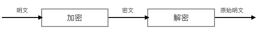
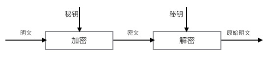
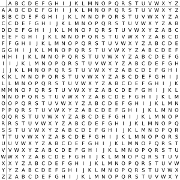
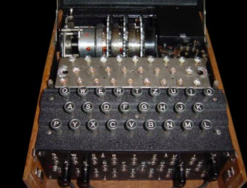
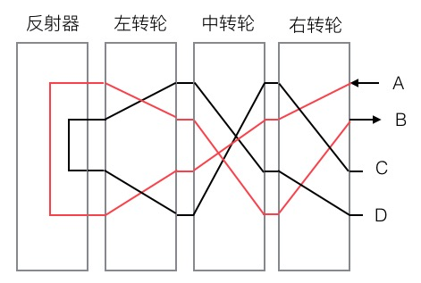

### 背景

---
> 前段时间有个文科朋友问我，能不能帮他拿到之前在他手机上登录过的别人的密码。我想了一下，用户登录的账号密码，如果保存在本地，不是应该加密过吗？如果保存的是用户第一次登录服务器返回的有时效性的token，这种情况肯定就拿不到明文密码了。那么本地保存的经过加密后的呢？或者，假定现在他是第一次登录的请求呢？

> 鉴于现大多数登录都是通过https，密码也是经过SSL安全传输层加密处理后发送到服务端的。如果登录使用的是http，登录也应该是经过一些hash处理并且搭配图形化的验证码或者验证短信作为验证，再配合后台的加密来保证一定程度的安全性的（介于窃听者不需要原始密码，通过hash结果等就可以伪造登录，所以前端加密只能用来保护用户的隐私，以防止被窃听的原文密码被用来社会学攻击上，比如用户多站点共享密码，攻击者窃听到http网站下的原文密码用在https的网站下）。接着我又想，那么保存在本地的加密后的密码呢，或者攻击者直接处理加密后的密文呢？

&emsp;&emsp; 以上只是我初步臆想，所以就有了进一步的学习，本来应该是了解关于网络安全的东西，但是偏偏就看了一下关于密码学的东西（密码学和网络安全是两个方向），然后发现密码学是一门深不可测但是很有意思的科学。下面给大家分享一下我收获的一些简单的知识。

### 一些密码学基础

---
先介绍一些密码学的基础知识

* 送者和接收者： 发送者想要发送消息给接收者，并且这个消息是安全的（让偷听者不能阅读这个消息）
* 消息和加密：消息被称作`明文`。通过某种方法伪装消息以隐藏它的内容的过程称作`加密`。被加密的消息被称作`密文`。相应的，把密文转变成明文的过程叫作`解密`。
	


* 算法和密钥：密码算法也叫`密码`，是用于加密和解密的数学函数。如果算法的保密性是针对于保持算法的秘密，这种算法称为受限制算法。按现在的标准，这种受限制算法保密性已经远远不够。现代密码学使用`秘钥`来解决了这个问题。有些算法使用两个不同的密钥，即加密密钥和解密密钥不同。这些算法的安全性就是基于密钥的安全性，而不是算法细节的安全性，这就意味着算法可以公开，即使偷听者知道算法，但是不知道具体使用的密钥，就不可能阅读消息。



* 密码系统：由所有可能的明文、密文、密钥、以及算法组成。
* 对称算法：又叫传统密码算法，加密秘钥能从解密密钥中推算出来，反过来也成立。通常加密和解密使用同一个密钥，称作`单密钥算法`或者是`秘密密钥算法`。
* 公开密钥算法（非对称算法）：用作加密的秘钥不同于用作解密的解密秘钥，而且解密秘钥不能通过加密秘钥计算出来（至少在合理假定的长时间内）。之所以叫作公开密钥算法，因为加密秘钥能够公开，但是偷听者只能使用加密秘钥加密信息，只有用相应的解密秘钥才能解密信息。这里，加密密钥又被称作`公开密钥`（简称公钥），解密秘钥称作`私人密钥`（简称私钥）。
* 混合密码系统：将对称密码和公钥密码结合起来的密码方式称为混合密码系统。
* 密码分析：密码分析是在不知道密钥的情况下，恢复出明文的科学。成功的密码分析能恢复明文或者密钥。也可以发现密码体制的弱点而得到明文和密钥。（密钥通过非密码分析的方式的丢失叫`泄露` ）
* 算法的安全性：那么什么样的算法才是安全的呢？如果破译算法的代价大于加密数据的价值；如果破译算法所需要的时间比加密数据保密的时间更长；如果用单密钥加密的数据量比破译算法需要的数据量少得多。那么你可能是安全的。


### 历史加密技术
#### 单表加密

---
&emsp;&emsp; 著名的恺撒密码是一种简单的替换密码，它的每一个明文字符都是由其右边第三个字符替换。它实际上是一种单表映射，数学上称为单射

以英文字母26个为例

明码表：ABCDEFGHIJKLMNOPQRSTUVWXYZ

密码表：DEFGHIJKLMNOPQRSTUVWXYZABC

如果我们输入HELLO WORLD，就会输出KHOOR ZRUOG

这种密码很好破解，密钥最多也就26个，暴力破解法（穷举法）手动都能找到

经过改版后的恺撒密码使用随机的密码表来使密钥数大量增加，就不是使用移位了，有A26(26) = 26!种可能密钥(手动暴力破解不是要试到猴年马月)。但是有一种高端的学科叫概率论，`频率分析法`就是这种单表映射的克星。拿到密文后，可以统计字母出现频率，再对照英文字母频率表来对照明文和密文的对应方式，这种方式需要交大的密文量，不然频率分析就不准确了。

#### 多表加密

---
&emsp;&emsp; 代表为维吉尼亚密码，是人们在单一恺撒密码的基础上扩展出的多表密码。多表加密，顾名思义，就是多张换字表（单表）进行加密，这样就可以消除字母出现的高频率，频率分析法也就失效了。



这张表叫做维热纳尔方阵，是为了方便加密者进行多字母替换而设计的。

&emsp;&emsp; 例如，第一张表中“A”对应“B”，那我加密时第一次遇到“A”就要将其加密为“B”；第二张换字表中“A”对应“C”，那么第二次遇见“A”，就加密为“C”，所以，如果我想加密“AA...”，那么密文就会是“BC...”。当换字表用尽时进行下一轮循环。

&emsp;&emsp; 维吉尼亚密码用到了循环，所以实际上，维吉尼亚密码就是有`周期`的多组单表替代。既然存在周期，那么就有被破译的可能，如果观察足够多的密文，就会发现间隔多少位，会有规律地出现特定的字母组，比如of、the，找到了这些重复出现的字母组，那么密钥长度，可能就是他们的间距。具体破解的方法叫`卡西斯基试验`，感兴趣的小伙伴可以去看看。

#### Enigma

---
&emsp;&emsp; 既然单表不安全，多表也会被破解，那么单表加多表的组合呢？

&emsp;&emsp; 1918年，德国发明家亚瑟·谢尔比乌斯的发明了一个机器并给它起名叫做Enigma（迷）。按下机器键盘上的一个键，上方显示器的一个母就会亮起来，同时在机器顶部的三个转轮最右边的那一个会相应转动一个位置。再按下相同的键，另一个字母又会亮起来。



&emsp;&emsp; 起初这台机器被用来加密商业机密，但是德国军方看上了它，于是在整个二次世界大战进程中，德军使用Enigma作为加密通讯信息的工具。

&emsp;&emsp; 这台机器看起来是一个装满了复杂而精致的元件的盒子，虽然Enigma看上去挺复杂，但是拆分下来，它是由`键盘（输入字符）`，`接线板`，`转轮`，`反射器`，和`显示器`组成

* 键盘：加密字符的录入
* 接线板：盒子最前面看到的那些插孔，操作员一般选6对字母插上交换线来改变字母对应关系，其他的字母不变，这相当于就是单表加密的作用，这里就有`100391791500`种可能的替换表。
* 转轮：转轮是enigma的核心，一个enigma机一般装了至少3个转轮，操作员输入一个字母，电流经过接线板进入第一个转轮，经过转子被置换成另一个字母（单个转子对输入内容所做的本质上是一次单字母替换加密），再相同地经过第二第三个转轮到达反射器，经反射器再反向经过刚才经过的转子到达显示器。不同的是，每输入一个字符，第一个转轮就会转动一格，当第一个转轮转到进位点时带动第二个转轮转动，同理，当第二个转轮转动到进位点时带动第三个转轮转动。转轮在生产出来替换规则就定死了，也就是说，一个转子提供26种不会改变的替换密码表，所以3个转子就是26^3 = `17576`个不同密码表，再加上德军一般是从5个转轮中选择3个并可以随便排列位置，这又有C3(5) * A3(3) = `60`种可能。（多表替换的表述决定密钥长度，“卡西斯基试验”在Enigma面前就没有什么用处了，17576的密钥长度意味着密文至少要在17576位之后才会出现循环加密，一般哪里有这么长的密文）
* 反射器：反射器和转子一样，区别在于`不会转动`，而且替换规则是`一对字母的替换`，比如输入A，反射器替换成B，输入B，反射器替换成A。这么设计的作用是为了让Enigma机能自我实现加密解密，可以类比光路可逆，电流流向也可逆，原理如下图。



假如输入A，电流流经3个转轮被反射器反射回到三个转轮输出B，那么我输入B，就可以反向输出A。

Enigma的操作员每个月都会收到一个密码本，指定每天使用的密钥，Enigma的密钥如下：

* 三个转子的排列顺序（例如转子从左至右编号分别为3-1-2）
* 三个转子的转动位置，这里称作指标组（例如转子当前转动到Z-Y-W）
* 接线板的设置（哪些字母两两交换）

&emsp;&emsp; 以上就是Enigma机的原理，关于Enigma的破译，最早破译Enigma的是波兰人，然后就是我们的计算机之父`图灵`最终破译了Enigma，这段历史感兴趣的小伙伴可以自己搜搜。

这里有一个在线Enigma的网站，可以去玩玩:http://enigmaco.de/enigma/enigma.html

在看到这里时，因为一直都在学习，两天没敲代码就手痒-0-，就想着自己用代码实现一下Enigma机。

#### Enigma机的js实现

---
&emsp;&emsp; 网上有很多实现enigma的代码，但是大多数都太算法化了，而且没有注释，比较难看懂，读别人代码尤其是没有注释的代码是很痛苦的一件事。我按我的理解用代码来还原enigma的整个系统，抽象出enigma机的各个部件，不对的地方还望指正。

&emsp;&emsp; 我用数组来作为enigma内部字母表的替换，比如初始状态为['A', 'B', 'C']，我的映射表为['B', 'C', 'A']，用两数组相同index的项作为替换规则，那么替换表结果就为 A => B、B => C。

&emsp;&emsp; 首先是反射板，因为反射板字母的替换规则必须是两两交换，所以写了一个shuffle函数来生成一个随机的两两交换的反射板

```
/**
 * 反射板
*/
class Reflector {
  constructor () {
    // 反射板字母反射关系
    this.mapping = ['A', 'B', 'C', 'D', 'E', 'F', 'G', 'H', 'I', 'J', 'K', 'L', 'M', 'N', 'O', 'P', 'Q', 'R', 'S'
      , 'T', 'U', 'V', 'W', 'X', 'Y', 'Z']
  }
  // 随机设置反射板映射关系  (两两交换)
  shuffle (arr) {
    let copyArr = arr.slice()
    let map = {}
    let resultList = []
    let count = 0
    while (copyArr.length > 0) {
      if (map[arr[count]]) {
        count++
        continue
      }
      // 记录处理过的字母
      map[arr[count]] = true
      copyArr.splice(copyArr.indexOf(arr[count]), 1)       
      let randSeq = Math.round(Math.random() * (copyArr.length - 1))
      if (!map[copyArr[randSeq]]) {
        // 随机一个字母的位置
        let index = arr.indexOf(copyArr[randSeq])
        // 交换位置后放在对应位置上
        resultList[count] = copyArr[randSeq]
        resultList[index] = arr[count]
        // 已换的位置作标记
        map[copyArr[randSeq]] = true
        // 删除已经交换的字母
        copyArr.splice(randSeq, 1)
        count++
      }
    }
    this.mapping = resultList
  }
  init () {
    // 打乱字母 生成随机的映射关系
    this.shuffle(this.mapping)
  }
}

```
&emsp;&emsp; 然后是转子，我以数组第一位作为`指标组`的位置，也是就当前转子转到哪里了，然后生成一个随机的`进位点`，转子的替换表规则不用两两交换，所以用了一个完全随机的函数打乱数组元素，然后包括转子的顺时针和逆时针转动。

```
/**
 * 转子  转子指标组默认为数组第一个位置
*/
class Roter extends Reflector {
  constructor () {
    super()
    // 用于表示该转子转动到哪儿了
    this.index = 0
    // 进位 该转子进位点
    this.carry = 0
  }
  // 顺时针旋
  cwRote (distance) {
    this.mapping = this.mapping.concat(this.mapping.splice(0, distance))
    this.index += distance
    while (this.index > 25) {
      this.index -= 26
    }
  }
  // 逆时针旋转
  acwRote (distance) {
    let len = this.mapping.length
    this.mapping = this.mapping.splice(len - distance, distance).concat(this.mapping)
    this.index -= distance
    while (this.index < 0) {
      this.index = 26 + this.index
    }
  }
  // 字母乱序 完全随机
  shuffle (arr) {
    let len = arr.length;
    for (let i = 0; i < len - 1; i++) {
      let idx = Math.floor(Math.random() * (len - i))
      let temp = arr[idx]
      arr[idx] = arr[len - i - 1]
      arr[len - i - 1] = temp
    }
    return arr
  }
  init () {
    // 打乱字母 生成随机的映射关系
    this.shuffle(this.mapping)
    // 生成 随机进位点
    this.carry = Math.round(Math.random() * 25)
  }
}
```
&emsp;&emsp; 接下来是接线板，接线板因为是需要接线员手动选择替换情况的，所以传入一个替换规则

```
/**
 * 接线板
*/
class Plug {
  constructor() {
    this.mapping = ['A', 'B', 'C', 'D', 'E', 'F', 'G', 'H', 'I', 'J', 'K', 'L', 'M', 'N', 'O', 'P', 'Q', 'R', 'S'
      , 'T', 'U', 'V', 'W', 'X', 'Y', 'Z']
  }
  /**
   * 设置接线板 字母交换情况：A和B交换  C和D交换
   * 交换的数组 [['A', 'B'], ['C', 'D']]
  */
  init (changeArr) {
    changeArr.map(item => {
      if (item[0] === item[1]) {
        return
      }
      let frontIdx = this.mapping.indexOf(item[0])
      let nextIdx = this.mapping.indexOf(item[1])
      let middle = this.mapping[nextIdx]
      this.mapping[nextIdx] = this.mapping[frontIdx]
      this.mapping[frontIdx] = middle
    })
  }
}
```
&emsp;&emsp; 好，现在零件都齐了，就剩最后组合出Enigma机了。首先是sortRoter函数，用来设置转子的排列顺序，接着是setRoterIndex函数，用来设置转子的转动情况。关键在于inputChar 字符录入函数，为了便于理解，用了current变量也就是数组当前索引来模拟电流流向，input作为一个零件的输入，多写了一个output变量作为一个零件的输出（一个零件的输出是另一个零件的输入），有点冗余，但是能清晰模拟电流方向。这样，电流经: 输入 ==> 接线板 ==> 第一个转子 ==> 第二个转子 ==> 第三个转子 ==> 反射器 ==> 第三个转子 ==> 第二个转子 ==> 第一个转子 ==> 输出。这样就很容易理解了。

```
/**
 * 英格玛机抽象类
*/
class Enigma {
  constructor () {
    this.reflector = new Reflector()
    this.plug = new Plug()
    this.roterArr = [new Roter(), new Roter(), new Roter()]
  }
  /*
   *设置接线板 字母交换情况
   * @changeArr  [['A', 'C']]  接线板转换情况
  */
  init (changeArr) {
    if (Object.prototype.toString.call(changeArr) !== '[object Array]') {
      return
    }
    this.reflector.init()
    this.plug.init(changeArr)
    this.roterArr.map(item => {
      item.init()
    })
  }
  /**
   * 设置转子排列顺序
   * [0, 1, 2]   [2, 0, 1] 转子排列
  */
  sortRoter (sort) {
    let first = this.roterArr[sort[0]]
    let second = this.roterArr[sort[1]]
    let third = this.roterArr[sort[2]]
    this.roterArr = [first, second, third]
  }
  /**
   * 设置转子 指标 转子指标组当前转到哪个位置
   * @arr ['A', 'B', 'C']
   * */ 
  setRoterIndex (arr) {
    if (Object.prototype.toString.call(arr) !== '[object Array]') {
      return
    }
    // 转动转子到指标所在位置
    let first = Math.abs(this.roterArr[0].mapping.indexOf(arr[0]))
    this.roterArr[0].cwRote(first)
    
    let second = Math.abs(this.roterArr[1].mapping.indexOf(arr[1]))
    this.roterArr[1].cwRote(second)
    
    let third = Math.abs(this.roterArr[2].mapping.indexOf(arr[2]))
    this.roterArr[2].cwRote(third)
  }
  inputChar (char) {
  	// 处理映射关系的数组
    let startArr = ['A', 'B', 'C', 'D', 'E', 'F', 'G', 'H', 'I', 'J', 'K', 'L', 'M', 'N', 'O', 'P', 'Q', 'R', 'S'
    , 'T', 'U', 'V', 'W', 'X', 'Y', 'Z']
    let input = char
    let output
    // 当前电流位置
    let current = startArr.indexOf(input)
    
    // 经过接线板
    output =  this.plug.mapping[current]
    input = output
    current = startArr.indexOf(input)

    // 经过第一个转轮
    output = this.roterArr[0].mapping[current]
    input = output
    current = startArr.indexOf(input)
    
    // 经过第二个转轮
    output = this.roterArr[1].mapping[current]
    input = output
    current = startArr.indexOf(input)
    
    // 经过第三个转轮
    output = this.roterArr[2].mapping[current]
    
    
    // 此时倒推回去    
    // 经过反射器
    input = output
    current = this.reflector.mapping.indexOf(input)
    output = startArr[current]

    // 经过第三个转轮
    input = output
    current = this.roterArr[2].mapping.indexOf(input)
    output = startArr[current]
    
    // 经过第二个转轮
    input = output
    current = this.roterArr[1].mapping.indexOf(input)
    output = startArr[current]

    // 经过第一个转轮
    input = output
    current = this.roterArr[0].mapping.indexOf(input)
    output = startArr[current]

    // 经过接线板
    input = output
    current = this.plug.mapping.indexOf(input)
    output = startArr[current]

    // 第一个转子顺时针转动1格
    this.roterArr[0].cwRote(1)
    // 第一个转子转到进位点
    if (this.roterArr[0].index == this.roterArr[0].carry) {
      // 第二个转子逆时针转动1格
      this.roterArr[1].acwRote(1)
    }
    // 第二个转子转到进位点
    if (this.roterArr[1].index == this.roterArr[1].carry) {
      // 第三个转子顺时针转动1格
      this.roterArr[2].cwRote(1)
    }
    
    return output 
  }
}
```
&emsp;&emsp; 以上是我实现的Enigma加密器，首先初始化enigma机，然后初始化接线板接线规则，调整转子排列顺序，调整转子位置，然后就可以单字符输入，经过一系替换后输出加密后的字符了。在相同的转子排列和转子位置下，输入加密后的字符，就可以输出刚才的明文字符。

### 现代加密技术

---
&emsp;&emsp; 在计算机出现以前，密码学由基于字符的密码组成。不同的密码算法是字符之间互相替换或者互相换位，好的密码是结合这两种方法进行多次运算。而现代的变化是算法对比特而不是对字母进行变换，实际上只是字母表的改变，从26个字符变成2个字符，好的算法仍然是代替和换位的组合。

Kerckhoff加密原则：一个安全保护系统的安全性不是建立在它的算法对于对手来说是保密的，而是应该建立在它所选择的密钥对于对手来说是保密的，这一原则现也被普遍承认为传统密码与现代密码的分界线。

#### 对称算法

---
最开始提到的，算法在加密和解密时使用相同的密钥，或是使用两个可以简单地相互推算的密钥。

* DES(Data Encryption Standard)：DES是现代密码的第一个标志，它在1977年被美国政府正式采纳为数据加密的标准，然而随着计算机进步，DES已经能被暴力破解了，强度大不如从前。
* 3DES（Triple DES）：DES的升级版，为了增强DES的强度，将DES重复3次得到的一种密码算法。
* AES(Advanced Encryption Standard)：是取代前任（DES）而成为新标准的一种对称算法，它的原型是一种名为Rijndael的对称密码算法，于2000年全世界若干候选对称算法中脱颖而出被选为新一代的标准密码算法---AES。

#### 公开密钥算法（非对称算法）

---
&emsp;&emsp; 在对称密码中，因为加密和解密使用的相同的密钥，所以必须向接收者配送密钥。公钥密码技术就是解决密钥的配送问题而产生的----两把钥匙，用`公钥加密`，用`私钥解密`

&emsp;&emsp; 我们来认识两个密码学上的知名人士Alice和Bob，现在他们是一对地下情侣，以及一个自作多情的第三者Eve。

&emsp;&emsp; Alice和Bob想互相写情书，但是他们不想让Eve偷看到他们互递情书内容，于是他们准备给情书加密。Alice加密后，把情书给Bob看，但是情书已经加密了，Bob看不懂，Alice意识到她还得把解密的密钥给一起发送给Bob。

&emsp;&emsp; 但是如果Alice直接把密文和密钥一起发送给Bob行不行呢？如果一起发送，Eve两个都会拿到就可以像Bob一样看情书的内容了，也就是说，同时发送密钥，Eve也能完成解密。Alice一筹莫展，密钥必须发送给Bob，但又不能发送，哎呀她要纠结死了。

后来，Alice想到，既然必须给钥匙，那么我可以准备两把钥匙啊，于是她和Bob商量这么做：

1）两人准备两把配对钥匙，一把用来加密（公钥），一把用来解密（私钥）。

2）Bob把他的公钥发送给Alice，这时被Eve截获，Eve很兴奋，“嗨呀，拿到你们的钥匙了”

3）然后Alice收到Bob的公钥后，用Bob的公钥加密，然后把密文发送给Bob。这时又被Eve截获，“嗨呀，看我破解你的密码，咦？怎么打不开呢？”

4）Bob拿到Alice给他的密文后，用自己的私钥对密文解密。（从此以后，Alice和Bob的地下恋情就不怕被Eve曝光了，我们只是在谈论学习，你是不会懂的。Eve还是一脸懵逼）

以上就是公钥密码在传输过程中的原理。

常见非对称算法有:

* DSA（Digital Signature Algorithm)：数字签名算法，是一种标准的 DSS（数字签名标准）
* ECC（Elliptic Curves Cryptography）：椭圆曲线密码，它是通过将椭圆曲线上的特定点进行特殊的乘法运算实现的，它利用了这种乘法运算的逆运算非常困难的特征。
* RSA（以三个开发者命名：Rivet、Shamir、Adelman)：现在使用最广泛的公钥密码算法，SSL的密码系统中就用到了它。

#### 证书

---

&emsp;&emsp; Alice和Bob的生活过得美滋滋，但是Eve很生气，Eve破解不了他们的加密的密码，“哼，没关系”。

1）Alice又在问Bob要公钥了，Bob收到命令后，把自己的公钥发送给Alice，这时又被Eve拿到了，Eve这次不给Alice了，它把Bob的公钥藏了起来，并且把自己的公钥发给Alice。

2）Alice拿到了钥匙，但是它以为这就是Bob的钥匙，于是写上“我爱你”，然后用这个公钥加密后发给Bob。

3）又被Eve拦截了，因为Alice使用的是它的公钥，所以Eve用自己的私钥打开，看到了“我爱你”，“哇，原来你们在我背后搞这些事情，我要拆散你们！”于是Eve写上，“你这个丑鬼，我再也不想见到你了”然后用刚才藏起来的Bob的公钥加密，发给Bob。

4) Bob心都碎了，重复上述，Eve也可以随意篡改Bob发给Alice的消息了。于是，两人分手了，嘿嘿嘿~

&emsp;&emsp; 以上是公钥密码算法潜在的问题，`中间人攻击`，但是这种攻击并不针对算法本身。公钥密码并没有被破译，密码算法正常工作并保证了机密性，但是机密性只是在Alice和Eve，Eve和Bob之间的。所以，仅仅靠公钥密码本身，无法防御中间人攻击。

&emsp;&emsp; 所以问题的起因就是不能判断公钥的由来，于是就有了`公钥证书`。公钥证书简称`证书`，和身份证相似，里面有各种个人所属信息，以及属于个人的公钥，并有`认证机构`（CA）施加`数字签名`。认证机构中有国际性组织和政府设立的组织，也有通过认证服务盈利的企业。这样相当于公钥就有了身份证，身份证该可以证明来源真实性了吧。

#### 数字签名

---
&emsp;&emsp; 数字签名就是现实社会中签名或者盖章这样的行为数字世界的实现，数字签名的处理过程耗时，一般不会对整个消息做数字签名，而是先通过`单项散列函数`计算出消息的散列值，再对这个散列值做数字签名。

&emsp;&emsp; 其中单项散列函数一般用于验证消息的`完整性`，我们经常做的登录验证实际上就是单项散列函数的一种应用，它能根据任意长度的消息计算出固定长度的散列值，通过对比散列值就可以判断两条消息是否一致。但是，单项散列函数能辨别出`“篡改”`，但无法辨别`“伪装”`。还需要上述的`认证`。

常见的单项散列函数有：

* MD4：Rivest于1990年设计的单项散列函数，不过随着Dobbertin提出寻找散列碰撞的方法，因此它现在已经不安全了。
* MD5：我们常见的MD5，是由Rivest于1991年设计的，它的强抗碰撞性也已经被攻破，因此也不安全了。
* SHA-1、SHA-256、SHA-384、SHA-512：由NIST（美国国家标准技术研究所）设计的单项散列函数，其中，SHA-1的强抗碰撞性已于2005年被攻破。SHA-256、SHA-384、SHA-512统称为SHA-2。


#### 混合密码算法

---
&emsp;&emsp; 使用对称密码，可以保证机密性，但是需要解决密钥配送问题；使用公钥密码，处理速度远远低于对称密码外，还难以防御中间人攻击。所以就有了混合密码系统---将对称密码和公钥密码相结合的方法。

&emsp;&emsp; 用快速的对称密码对消息加密，消息转换成了密文，保证了消息的`机密性`。然后用公钥密码对对称密码的密钥进行加密，由于对称密码的密钥一般比信息短，所以公钥密码的速度慢的问题就可以被忽略了，这样就保证了密钥配送的`安全性`。

&emsp;&emsp; 混合密码系统还用了`伪随机数生成器`生成对称密码加密中使用的会话密钥，结合这三种技术创造出了兼具两者优点的密码方式。著名密码软件`PGP`，以及我们众所周知的`SSL/TLS`都运用的是混合密码系统。

### 结语

---
&emsp;&emsp; 本来想再仔细研究现代加密算法的具体实现，但是发现自己大脑已经发烧，这次就先到这里，虽然自己还在密码世界的大门之外，但是也略有所获，我先去买瓶六个核桃。


